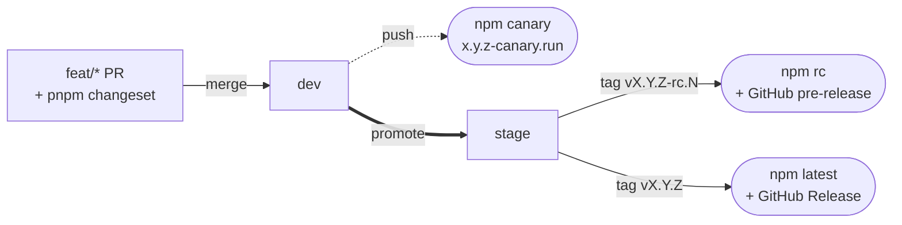

# Contributing

Thanks for jumping in. This guide gets you productive fast. The deep brief lives in
[AGENTS.md](./AGENTS.md) - read it before your first change; it is the canonical
source for architecture, naming, boundaries, and the "where does X go?" decision tree.

## Prerequisites

| Tool   | Version                                                       |
| ------ | ------------------------------------------------------------- |
| Node   | 26+                                                           |
| pnpm   | 11+ (via `corepack enable`)                                   |
| Docker | Postgres + Redis - required, the test suite runs against both |

## First run

```bash
pnpm install
pnpm setup:agent   # boots Docker (Postgres + Redis), runs migrations, prints a summary
pnpm seed          # demo data: admin + players + wallets + transactions + games
pnpm dev           # api :3001, mcp dev server
```

Backoffice login: `admin@oss.dev` / `password123` (see `pnpm seed --help` for flags).

## Day-to-day commands

| Command                 | What it does                                                                                                              |
| ----------------------- | ------------------------------------------------------------------------------------------------------------------------- |
| `pnpm dev`              | turbo dev across api, mcp                                                                                                 |
| `pnpm regen`            | drizzle-kit generate + openapi emit + sdk regen + catalog                                                                 |
| `pnpm verify`           | typecheck + lint (incl. boundaries + module shape) + unit tests - needs `docker compose up -d`                            |
| `pnpm test:integration` | whole-app suites booted through `bootTestApp` against a shared `TEST_DATABASE_URL` database                               |
| `pnpm sync:agents`      | regenerate the per-tool agent files (AGENTS.md / CLAUDE.md / .codex/config.toml / Copilot) from `.rulesync/` via rulesync |

## Scaffolding (don't hand-roll)

```bash
pnpm gen module <name>           # new module under packages/addons/<name>
pnpm gen plugin <name>           # overlay extension under extensions/<name>/
pnpm gen route <module> <method> <path>
```

Each scaffolded file marks editable regions with `// AGENT: implement here` - fill those,
leave the wiring alone. After scaffolding a module/table: `pnpm regen && pnpm verify`.

## Branch model

| Branch                       | Purpose                                                                          |
| ---------------------------- | -------------------------------------------------------------------------------- |
| `dev`                        | Shared integration branch - the source of truth. Keep it green; MRs land here.   |
| `stage`                      | Pre-prod / release-candidate. Promoted from `dev`; stable releases are cut here. |
| `feat/*`, `fix/*`, `chore/*` | Short-lived topic branches. Branch off `dev`, open an MR back into `dev`.        |

Flow: `feat/*` -> MR -> `dev` (publishes `canary`) -> promote to `stage` -> tag `vX.Y.Z-rc.N` for a
release candidate (`rc`), `vX.Y.Z` for stable (`latest`). See [Releasing](#releasing-openora-to-npm) below.
CI (`.github/workflows/ci.yml`) runs `verify` on every pull request and on
pushes to `dev`.

## Releasing (`@openora/*` to npm)

Stable and rc versions are driven by [Changesets](https://github.com/changesets/changesets) - you
never hand-edit a release version. Any PR that changes published behavior includes a changeset
(`pnpm changeset` -> pick patch/minor/major + a one-line summary); the tooling computes the stable
version from those. Canary builds ignore changesets and publish continuously (below). The two
published packages (`@openora/core`, `@openora/mcp`) move together as a fixed group.



- **`dev` push -> `canary`** (automatic, always). Every merge to `dev` publishes an immutable build
  (`x.y.z-canary.<run>`) under the `canary` dist-tag, independent of changesets - the base is the
  latest published stable patch-bumped so canary always leads it, and `<run>` is the CI run number
  (a monotonic, sha-free counter). Install with `pnpm add @openora/core@canary`. Nothing is committed;
  this is the rolling dev channel consumers track.
- **rc + stable are tag-driven from `stage`** (`.github/workflows/release.yml` - the tag name IS the
  version):
  - **rc**: `git tag vX.Y.Z-rc.N && git push origin vX.Y.Z-rc.N` -> publishes to the `rc` dist-tag +
    a GitHub **pre-release**. A candidate for the upcoming `X.Y.Z`; changesets are left intact.
  - **stable**: first `pnpm changeset version` (consumes changesets, bumps `@openora/*`, writes
    CHANGELOGs) -> commit + push `stage` (and fast-forward `dev` so the trunk stays in sync), then
    `git tag vX.Y.Z && git push origin vX.Y.Z` -> publishes `latest` + a GitHub Release.

Auth is a single `NPM_TOKEN` repo secret (an npm automation / 2FA-bypass token). The downstream consumer
and example-demo redeploys fire from the `canary` channel via repo secrets - all encrypted, none public.

## Commits

Conventional Commits, **enforced** by `commitlint` (local `commit-msg` hook + CI) as
`type(scope): summary`. A non-conforming message blocks the merge.

- **Types:** `feat`, `fix`, `refactor`, `chore`, `docs`, `test`, `ci`, `perf`, `build`, `style`, `revert`.
- **Scope is a fixed list, not free-form.** `commitlint.config.cjs` derives a `scope-enum` from the
  workspace - every `packages/*` and `packages/core/src/*` module dir, add-ons, apps, plus meta scopes
  (`ci`, `deps`, `rules`, `repo`, `tooling`, ...). An unlisted scope fails the lint; omit the scope if
  none fits. Check a message with `pnpm commitlint --from HEAD~1`.
- One MR = one concern; stage explicitly (`git add <paths>`), don't sweep foreign changes with `git add -A`.
- No sensitive/internal data in messages - reference a ticket by bare key (`ABC-45`), never a URL.
- Sign off each commit (`git commit -s`) per the DCO (see License below).

```
feat(wallet): atomic debit command port
fix(audit): guard double-record on retry
chore(deps): bump zod to 3.24.0
```

Full standard: [`.rulesync/rules/conventions.md`](.rulesync/rules/conventions.md) > Git and delivery.

## Before you open an MR

```bash
pnpm verify
```

Must pass. CI additionally runs a "no drift" check: it re-runs drizzle-kit + the catalog
generator and fails on an uncommitted diff. So if you touched schemas or routes, run
`pnpm regen` and commit the generated output.

## House rules (the short version - full list in AGENTS.md)

- Zod-first. Every shape is a schema; types are `z.infer`'d, never hand-written.
- No `any` outside `*.test.ts`. No inline `fetch`/`axios`. No decorators.
- Cross-module talk goes through events or contracts - never import another module's internals.
- Anything that touches the database is tested against real Postgres (`createTestDb` from
  `@openora/core/testing`), never a faked query builder. Only external vendors and cross-module
  ports are doubled.
- New functionality enters only via `definePlugin`. No auto-discovery, no magic.
- ASCII only in code. Short dashes (-) only.
- Don't hand-edit generated files: drizzle migrations, `docs/openapi.json`, `docs/catalog.json`,
  and the rulesync-generated agent files (`AGENTS.md`, `CLAUDE.md`, `.codex/config.toml`,
  `.github/copilot-instructions.md`, and the `.claude/`, `.github/` mirrors) - edit
  `.rulesync/` and run `pnpm sync:agents`.

## License and contributions

This project is dual-licensed: **AGPL-3.0-only** ([LICENSE](./LICENSE)) or a
commercial license from Blurify ([LICENSE-COMMERCIAL.md](./LICENSE-COMMERCIAL.md)).

For the dual-license model to work, contributions must be available under both.
By submitting a contribution (a commit, patch, or MR), you:

- License your contribution to the project and its users under the AGPL-3.0-only
  (inbound = outbound), and
- Grant Blurify a perpetual, worldwide, non-exclusive, royalty-free right to use,
  relicense, and sublicense your contribution - including under the commercial
  license above - so it can be offered to commercial licensees.

You confirm you have the right to grant this (the work is yours, or you have
permission), per the [Developer Certificate of Origin](https://developercertificate.org/).
Sign off your commits with `git commit -s` (adds a `Signed-off-by` line).

You retain copyright in your contribution. If you cannot grant the commercial
relicensing right above, say so in your MR so we can discuss before merging.

## Working with AI agents

Every module ships an `AGENTS.md`. The `oss-dev` MCP server (stdio, see `.mcp.json`) exposes
the schema registry, route catalog, plugin manifest, and scaffolders as tools. Start at
[docs/agent-quickstart.md](./docs/agent-quickstart.md).
