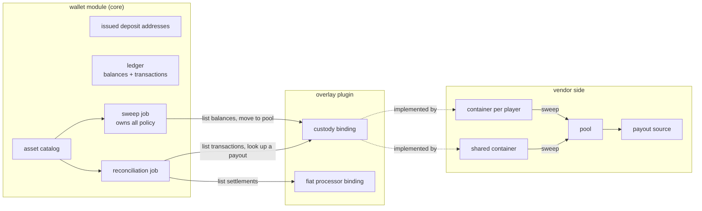
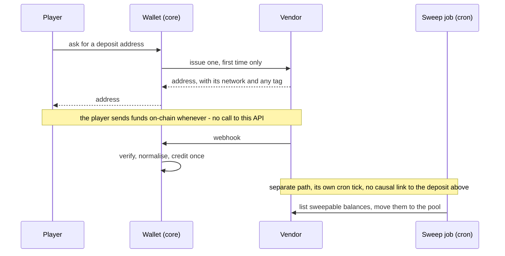

# Custody Adapter

The crypto half of the [payment port](./payment.md): the extra capabilities a vendor needs when it
holds funds per player rather than settling a charge. Read
[`docs/standards/custody.md`](../standards/custody.md) for the money rules the caller must follow
either way; this file is the topology and the flow.

## Four vendor shapes

| Vendor shape                               | Issues addresses | Sends webhooks | Pools and sweeps   | Reports its transactions |
| ------------------------------------------ | ---------------- | -------------- | ------------------ | ------------------------ |
| Synchronous fiat processor                 | no               | no             | no                 | settlement report only   |
| Custody with a container per player        | yes              | yes            | yes                | yes                      |
| Exchange-style, one address plus a tag     | yes, as a tag    | yes            | no, already pooled | yes                      |
| Crypto processor that pools on your behalf | yes              | yes            | no                 | yes                      |

Sweeping is optional. Reconciliation is not: it applies to a fiat processor's settlement report
exactly as it applies to an on-chain ledger.

## Why the address topology differs by chain

- **UTXO chains** - one container mints an unlimited number of receive addresses, one per player.
  The address alone identifies the player.
- **Account chains** - a container holds a single address, so a distinct address per player means a
  container per player. That one address also serves every token on the chain, and the same string
  repeats across sibling chains. An inbound event that carries only an address is therefore
  ambiguous; it must carry the network too.
- **Tag chains** - one shared address plus a per-player tag. The pair identifies the player, and
  the tag is optional on the wire, so funds can arrive with none.

## Custody topology

## Crediting and sweeping are independent

A deposit never triggers a sweep. Crediting the player and moving the funds are separate paths: the
first runs on every deposit, the second on the sweep job's own cadence, and neither waits on the
other. A vendor outage that blocks sweeping must never delay a credit.

## Sweep cycle

Each tick resolves what is still in flight, then considers every balance the vendor reports. A
balance is swept only when all of these hold:

1. The operator's asset catalog has the currency and network. An unlisted pair is not ours to move.
2. The amount clears the dust floor. Below it, the fee is a larger share than the funds.
3. The amount is worth several times the current network fee, so the move is not mostly cost.
4. The fee itself is under its ceiling - unless the pool has fallen below its liquidity floor, in
   which case paying an expensive fee beats failing a payout.
5. Nothing is already in flight for that player, currency and network.

The vendor call happens outside the database transaction, after the row is claimed, and the result
is audited. Every threshold is set per currency and network: the same token costs cents on one
chain and dollars on another.

## Reconciliation

Three things start a finding.

- **The scheduled sweep of vendor transactions.** Every deposit the vendor reports is matched
  against the ledger. No matching row, or a row whose amount or currency disagrees, is a finding.
- **Payouts that have waited too long.** Anything still unsettled past an age threshold gets a
  targeted status lookup. A vendor that reports a final state closes it; a vendor that knows
  nothing about it is a finding.
- **The live path failing to attribute a deposit.** Funds arrived and no player could be resolved.

Findings are reported, never auto-credited. Crediting one is an admin action with an actor and a
reason, and both the run and the resolution go to the audit log. Findings past a threshold raise an
alert, because a rising count means the live path is broken, not that the reconciler is working.

## Policy lives in core, topology lives in the overlay

Core learns the shape of custody - containers per player, pooling, on-chain fees, a vendor's
transaction list - and never a vendor's name. Which chains are UTXO, account-based or tag-based is
vendor topology and belongs in the overlay.

## Running more than one vendor

The adapter and the webhook verifier are each a single binding, and the last registration wins, so
two overlays that both bind them would clobber each other. Running a fiat processor and a crypto
custodian at once therefore goes through a provider registry: the asset catalog names a provider
per pair, and the registry maps that name to one adapter-and-verifier pair. Core only looks a name
up; it never discovers vendors by itself, so the operator composes the map in their own plugin.

The webhook route resolves the verifier and the adapter from the **same** entry. A body can never
be verified against one vendor's key and then parsed in another's format.
