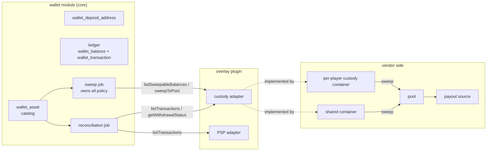
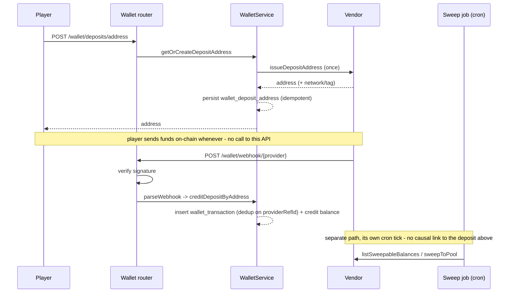
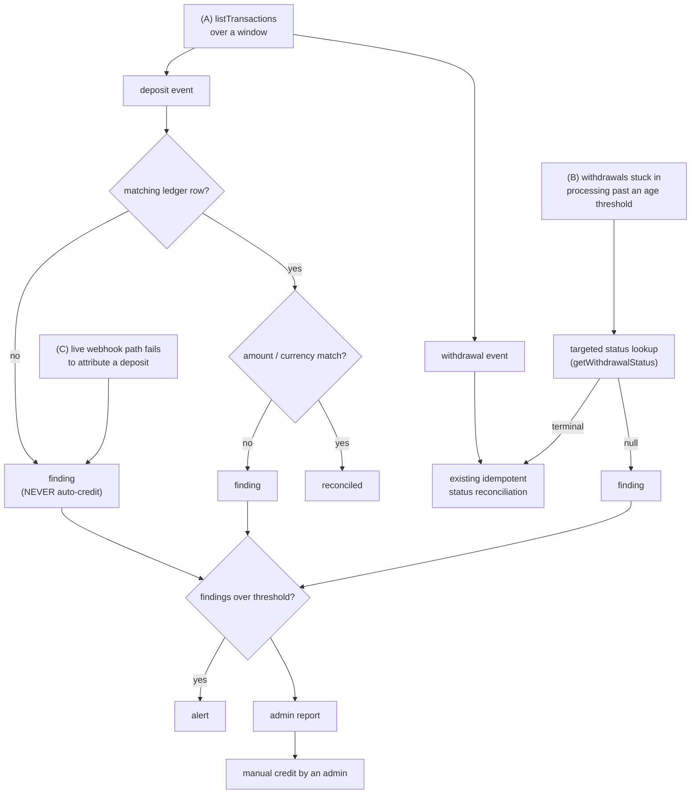
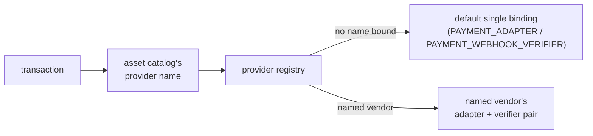

# Custody Adapter

The crypto half of the [payment port](./payment.md). Same `PaymentAdapter` interface, plus the
optional methods a vendor that holds funds per player must implement. Read
[`docs/standards/custody.md`](../standards/custody.md) for the money rules the caller must
follow either way; this file is the port and the topology.

Four vendor shapes this port has to cover, by which optional methods they implement:

| Vendor shape                                | issueDepositAddress | parseWebhook | sweep methods       | listTransactions             |
| ------------------------------------------- | ------------------- | ------------ | ------------------- | ---------------------------- |
| Synchronous fiat PSP                        | no                  | no           | no                  | optional (settlement report) |
| Custody with per-player containers          | yes                 | yes          | yes                 | yes                          |
| Exchange-style, one address + memo          | yes (tag)           | yes          | no (already pooled) | yes                          |
| Crypto payment processor that pools for you | yes                 | yes          | no                  | yes                          |

Sweeping is optional, reconciliation is universal - it applies to a fiat PSP settlement
report exactly as to an on-chain ledger.

## Why deposit-address topology differs by chain

- **UTXO chains** - one shared container can mint unlimited receive addresses, one per
  player. Attribution is by address alone.
- **Account/EVM chains** - a container holds one address, so a distinct address per
  player means one container per player. That single address also serves every token on
  the chain, which is why a deposit event carries `network` and not just `address` -
  `address` alone does not identify which chain (or which of several issued rows) it
  belongs to.
- **Tag/memo chains** - one shared address plus a per-player tag; attribution is by
  `(address, tag)`.

## Custody topology



## Crediting and sweeping are independent



A deposit never triggers a sweep. Crediting the player and moving the funds into the
pool are independent code paths - the first happens on every deposit, the second on
whatever cadence the sweep job runs, and neither waits on the other.

## Sweep cycle

```mermaid
flowchart TD
  tick["cron tick"] --> inflight["resolve in-flight sweeps"]
  inflight --> perprovider["for each provider"]
  perprovider --> impl{"adapter implements<br/>listSweepableBalances?"}
  impl -- no --> skip["skip"]
  impl -- yes --> list["list balances"]
  list --> perbalance["for each balance"]
  perbalance --> catalogRow{"catalog row exists?"}
  catalogRow -- no --> skip
  catalogRow -- yes --> minDeposit{"amount >= minimum<br/>deposit (dust)?"}
  minDeposit -- no --> skip
  minDeposit -- yes --> feeMultiple{"amount >= fee x<br/>fee-multiple?"}
  feeMultiple -- no --> skip
  feeMultiple -- yes --> feeCeiling{"fee within ceiling,<br/>unless pool is below<br/>its liquidity floor?"}
  feeCeiling -- no --> skip
  feeCeiling -- yes --> noInflight{"no in-flight sweep for<br/>this (user, currency, network)?"}
  noInflight -- no --> skip
  noInflight -- yes --> claim["claim a row"]
  claim --> call["call sweepToPool<br/>(outside the transaction)"]
  call --> markAudit["mark and audit"]
```

## Reconciliation



## Policy lives in core, topology lives in the overlay

Core learns the _shape_ of custody - per-player containers, pooling, on-chain fees, a
provider's transaction list - never a vendor's name. Which chains are UTXO, account-based,
or tag-based is vendor topology, not policy; it belongs in the overlay adapter, not in
core.

## Routes this port backs

| Route                                      | Does                                                      | Permission                      |
| ------------------------------------------ | --------------------------------------------------------- | ------------------------------- |
| `POST /wallet/webhook/{provider}`          | Routes an inbound webhook to the named provider's adapter | none (signature-verified)       |
| `POST /wallet/deposits/address`            | Issues (once) and returns the player's deposit address    | player session                  |
| `POST /wallet/custody/sweep/run`           | Enqueues one sweep cycle on demand                        | `wallet-custody:run`            |
| `GET /wallet/reconciliation`               | Lists open findings                                       | `wallet-reconciliation:view`    |
| `POST /wallet/reconciliation/{id}/resolve` | Resolves a finding, including a manual credit             | `wallet-reconciliation:resolve` |
| `POST /wallet/reconciliation/run`          | Enqueues one reconciliation pass on demand                | `wallet-reconciliation:run`     |

## Running more than one vendor



`PAYMENT_ADAPTER` and `PAYMENT_WEBHOOK_VERIFIER` are single DI bindings, and
`Container.register` is last-wins - two overlays each rebinding them would clobber each other.
Running a fiat PSP and a crypto custodian at once therefore goes through `PAYMENT_PROVIDERS`,
which maps `wallet_asset.providerName` to one `{ adapter, webhookVerifier }` pair. Core only
looks a name up there; it never discovers vendors itself, so the operator composes that map in
their own plugin.

The webhook route resolves the verifier and the adapter from the **same** entry, so a body can
never be verified against one vendor's key and parsed in another's format.
