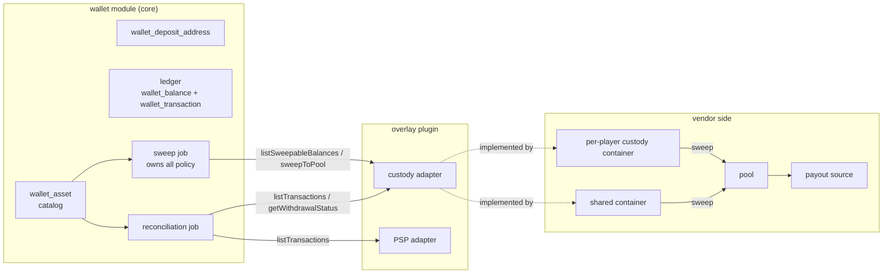
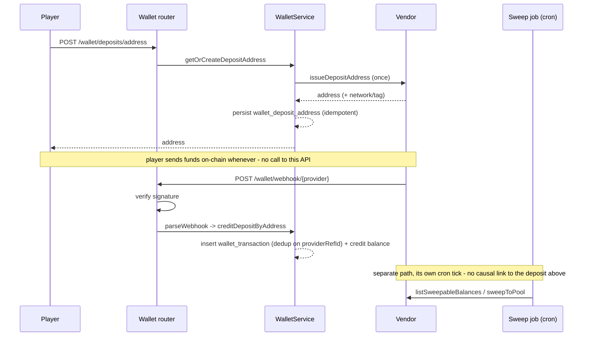
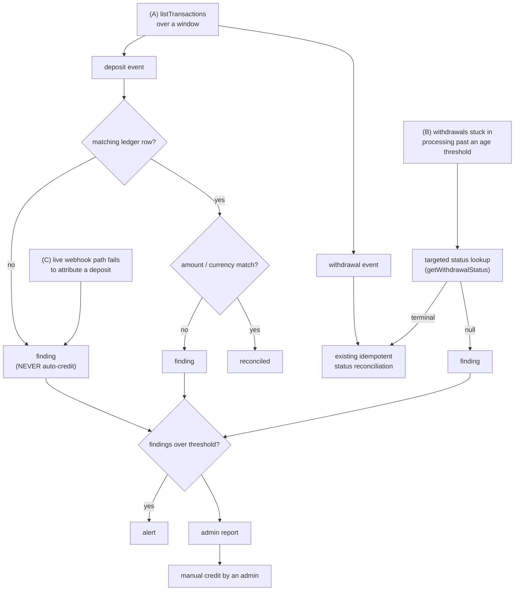
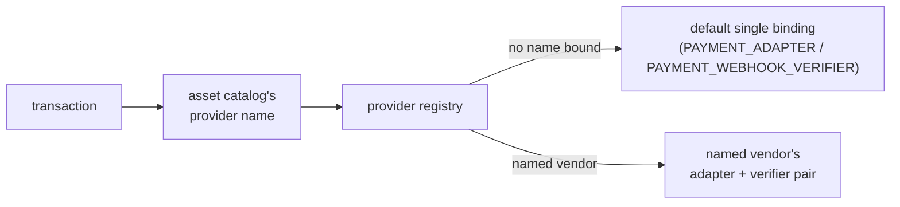

# Payment Adapter

## Interface

Source of truth: [`packages/core/src/contracts/adapters/payment.ts`](../../packages/core/src/contracts/adapters/payment.ts) - `PaymentAdapter`, `PaymentWebhookEvent`, `PaymentWebhookVerifier`, and the `PAYMENT_ADAPTER` / `PAYMENT_WEBHOOK_VERIFIER` tokens.

`issueDepositAddress` and `parseWebhook` are optional - present only on address-based/async vendors, omitted by a synchronous PSP (see the two vendor shapes below).

## Default binding

The `wallet` module ships `MockPaymentAdapter` (synchronous, always returns
`{ externalId, status: 'completed' }` for both deposits and withdrawals) as the default
`PAYMENT_ADAPTER` binding, and `HmacPaymentWebhookVerifier` as the default
`PAYMENT_WEBHOOK_VERIFIER` binding - both wired in `wallet/src/plugin.ts`. This is
intentionally permissive for local dev; neither talks to a real payment rail.

## Two vendor shapes this port covers

**Synchronous PSP** (card/bank/e-wallet): `processDeposit`/`processWithdrawal` return an
already-terminal `status` (`'completed'`/`'failed'`) in the same call. The wallet module
finalizes the transaction immediately - this is `MockPaymentAdapter`'s shape, and the
one most PSP integrations use. `issueDepositAddress`/`parseWebhook` are omitted
entirely.

**Custody/address-issuing vendor** (a crypto MPC/custody rail): deposits are inbound and
address-based - a player is handed a deposit address (`issueDepositAddress`) and sends
funds whenever; the vendor confirms asynchronously via webhook. Withdrawals go through
multiple intermediate states (`processWithdrawal` returns a non-terminal `status`, eg
`'submitted'`) before reaching a terminal one, also reported via webhook. Both paths
resolve through `parseWebhook` -> the wallet's webhook route (`POST /wallet/webhook`) ->
`WalletService.creditDepositByAddress` / `reconcileWithdrawalStatus`.

## Binding a real vendor

1. Create an overlay plugin (or extend an existing one):

```bash
/scaffold-plugin custody-payment
```

2. Implement `PaymentAdapter` against the vendor's API. For a synchronous PSP, only
   `processDeposit`/`processWithdrawal` are needed. For a custody/address-issuing
   vendor, add `issueDepositAddress` and `parseWebhook`:

```ts
// extensions/custody-payment/src/custody-payment-adapter.ts
import type { PaymentAdapter, PaymentWebhookEvent } from '@openora/core/contracts';

export class CustodyPaymentAdapter implements PaymentAdapter {
  async processDeposit(amount: string, currency: string, metadata: Record<string, unknown>) {
    // Not called for an address-based vendor - deposits arrive via webhook instead.
    throw new Error('use issueDepositAddress + the webhook path for deposits');
  }

  async processWithdrawal(amount: string, currency: string, metadata: Record<string, unknown>) {
    // POST to the vendor's payout/transaction API; the vendor confirms async.
    // Return a non-terminal status - the wallet module leaves the transaction
    // `processing` and relies on the webhook for the eventual completed/failed.
    return { externalId: 'vendor-tx-id', status: 'processing' };
  }

  async issueDepositAddress(userId: string, currency: string) {
    // POST to the vendor's address/session API for this asset.
    return { address: 'vendor-issued-address' };
  }

  parseWebhook(
    rawBody: string,
    headers: Record<string, string | string[] | undefined>,
  ): PaymentWebhookEvent | null {
    // Normalize the vendor's raw webhook payload into the shared shape.
    const body = JSON.parse(rawBody);
    if (body.type === 'deposit') {
      return {
        kind: 'deposit',
        address: body.destinationAddress,
        amount: body.amount,
        currency: body.asset,
        txHash: body.txHash,
        externalId: body.id,
      };
    }
    if (body.type === 'withdrawal') {
      return { kind: 'withdrawal', externalId: body.id, status: body.status };
    }
    return null;
  }
}
```

3. Bind the adapter (and, if the vendor uses its own signature scheme rather than
   HMAC-SHA256, a matching `PaymentWebhookVerifier`) in the plugin, AFTER `wallet` in
   `extensions.config.ts` (last registration wins):

```ts
// extensions/custody-payment/plugin.ts
import { PAYMENT_ADAPTER, PAYMENT_WEBHOOK_VERIFIER } from '@openora/core/contracts';
import type { CoreTokenCatalog, Plugin } from '@openora/core/server';
import { CustodyPaymentAdapter } from './src/custody-payment-adapter.js';

export default {
  id: 'custody-payment',
  dependsOn: ['wallet'],
  register(ctx) {
    ctx.provide(PAYMENT_ADAPTER, () => new CustodyPaymentAdapter());
    // Omit this line to keep the default HmacPaymentWebhookVerifier (PAYMENT_WEBHOOK_SECRET env var).
  },
} as const satisfies Plugin<CoreTokenCatalog>;
```

4. Register in `extensions.config.ts` **after** the `wallet` entry.

## Webhook recipe: create/issue -> webhook reconciles

The address-based/async recipe is the same shape regardless of vendor:

1. Player calls `POST /wallet/deposits/address` (`{ currency }`) -> `getOrCreateDepositAddress`
   calls `issueDepositAddress` once and persists the result in `wallet_deposit_address`
   (idempotent - a second call for the same user/asset returns the stored address
   without a second vendor call).
2. The vendor sends funds to that address whenever the player deposits, then POSTs a
   webhook to `POST /wallet/webhook`.
3. The route verifies the raw body against `PAYMENT_WEBHOOK_VERIFIER` (fail closed on a
   missing/invalid signature), calls `parseWebhook`, and dispatches: a `deposit` event
   resolves the address back to a userId and credits the wallet (idempotent on the
   vendor's `externalId` via the `wallet_transaction.provider_ref_id` unique index); a
   `withdrawal` event transitions a `processing` transaction to its terminal state
   (idempotent - a replayed or stray webhook for an already-terminal/unmatched row
   no-ops).

See the wallet contract and service for the exact route behavior.

## Custody: pooling, sweeping and reconciliation

Four vendor shapes this port has to cover, by which optional methods they implement:

| Vendor shape                                | issueDepositAddress | parseWebhook | sweep methods       | listTransactions             |
| ------------------------------------------- | ------------------- | ------------ | ------------------- | ---------------------------- |
| Synchronous fiat PSP                        | no                  | no           | no                  | optional (settlement report) |
| Custody with per-player containers          | yes                 | yes          | yes                 | yes                          |
| Exchange-style, one address + memo          | yes (tag)           | yes          | no (already pooled) | yes                          |
| Crypto payment processor that pools for you | yes                 | yes          | no                  | yes                          |

Sweeping is optional, reconciliation is universal - it applies to a fiat PSP settlement
report exactly as to an on-chain ledger.

### Why deposit-address topology differs by chain

- **UTXO chains** - one shared container can mint unlimited receive addresses, one per
  player. Attribution is by address alone.
- **Account/EVM chains** - a container holds one address, so a distinct address per
  player means one container per player. That single address also serves every token on
  the chain, which is why a deposit event carries `network` and not just `address` -
  `address` alone does not identify which chain (or which of several issued rows) it
  belongs to.
- **Tag/memo chains** - one shared address plus a per-player tag; attribution is by
  `(address, tag)`.

### Custody topology



### Crediting and sweeping are independent



A deposit never triggers a sweep. Crediting the player and moving the funds into the
pool are independent code paths - the first happens on every deposit, the second on
whatever cadence the sweep job runs, and neither waits on the other.

### Sweep cycle

```mermaid
flowchart TD
  tick["cron tick"] --> inflight["resolve in-flight sweeps"]
  inflight --> perprovider["for each provider"]
  perprovider --> impl{"adapter implements<br/>listSweepableBalances?"}
  impl -- no --> skip["skip"]
  impl -- yes --> list["list balances"]
  list --> perbalance["for each balance"]
  perbalance --> catalogRow{"catalog row exists?"}
  catalogRow -- no --> skip
  catalogRow -- yes --> dust{"amount >= dust<br/>threshold?"}
  dust -- no --> skip
  dust -- yes --> feeMultiple{"amount >= fee x<br/>fee-multiple?"}
  feeMultiple -- no --> skip
  feeMultiple -- yes --> feeCeiling{"fee within ceiling,<br/>unless pool is below<br/>its liquidity floor?"}
  feeCeiling -- no --> skip
  feeCeiling -- yes --> noInflight{"no in-flight sweep for<br/>this (user, currency, network)?"}
  noInflight -- no --> skip
  noInflight -- yes --> claim["claim a row"]
  claim --> call["call sweepToPool<br/>(outside the transaction)"]
  call --> markAudit["mark and audit"]
```

### Reconciliation



### Multi-provider routing



### Policy lives in core, topology lives in the overlay

Core learns the _shape_ of custody - per-player containers, pooling, on-chain fees, a
provider's transaction list - never a vendor's name. Which chains are UTXO, account-based,
or tag-based is vendor topology, not policy; it belongs in the overlay adapter, not in
core.

### Routes

| Route                                      | Does                                                                                            | Permission                      |
| ------------------------------------------ | ----------------------------------------------------------------------------------------------- | ------------------------------- |
| `POST /wallet/webhook/{provider}`          | Routes an inbound webhook to the named provider's adapter instead of the single default binding | none (signature-verified)       |
| `POST /wallet/custody/sweep/run`           | Triggers one sweep cycle on demand                                                              | `wallet-custody:run`            |
| `GET /wallet/reconciliation`               | Lists open findings                                                                             | `wallet-reconciliation:view`    |
| `POST /wallet/reconciliation/{id}/resolve` | Resolves a finding (including a manual credit)                                                  | `wallet-reconciliation:resolve` |
| `POST /wallet/reconciliation/run`          | Triggers one reconciliation pass on demand                                                      | `wallet-reconciliation:run`     |

### Multiple vendors

`PAYMENT_ADAPTER` and `PAYMENT_WEBHOOK_VERIFIER` remain single DI bindings, exposed as
the `default` entry of `PAYMENT_PROVIDERS`. An operator running a fiat PSP and a crypto
custodian at once rebinds `PAYMENT_PROVIDERS` with a map of named pairs and sets
`wallet_asset.providerName` per (currency, network); withdrawal settlement and deposit
address issuance then resolve the adapter from that column, and a webhook resolves both
verifier and adapter from the same entry.

### Treasury

`wallet.treasuryRef` (platform config) names the vendor-side account sweeps move player
funds into and withdrawals are paid out of. It is passed to `sweepToPool` and recorded on
`wallet_custody_sweep.poolRef` when the vendor does not return one of its own. Absent, the
destination is whatever the adapter defaults to and `poolRef` stays null.

### Dust

The sweep dust floor is `wallet_asset.sweepDustThreshold`, falling back to `minDeposit`
when it is not set - so raising a deposit minimum does not silently change what gets swept.
