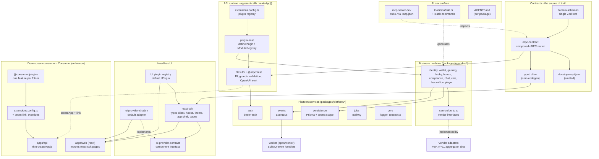
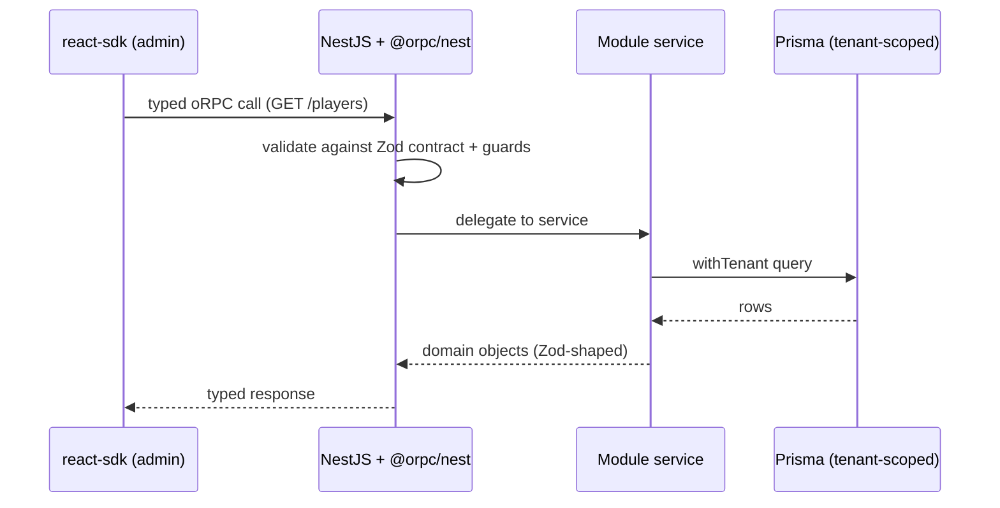

# Architecture

How the platform fits together: the contract spine, the plugin host that loads
everything, the adapter seams that keep it swappable, and how a downstream
consumer (Consumer) reuses it without forking.

For the rationale behind each choice, see the [ADRs](./adr/). For the rules an
agent must follow, see [AGENTS.md](../AGENTS.md).

## System overview

Solid arrows are runtime/build dependencies; dashed arrows are **adapter seams**
(one side declares an interface, the other implements it - swap freely).

## The parts

**Contracts**

- **domain-schemas** - the single Zod root. Every type is `z.infer`'d from here; nothing is hand-written. ADR-0004.
- **orpc-contract** - composes each module's router into one contract. From it the build emits `docs/openapi.json` and a fully typed client (no codegen step). ADR-0001.

**API runtime**

- **extensions.config.ts** - the one list of enabled plugins (modules + overlays). The only place wiring is turned on.
- **plugin-host** - `definePlugin({ id, dependsOn, register })` + `ModuleRegistry`. The bridge that mounts providers, controllers, events, prisma extensions, and MCP tools into the app. ADR-0002.
- **NestJS + @orpc/nest** - owns DI, lifecycle, guards, request validation, and OpenAPI emission. `apps/api` is a thin caller of `createApp()` from `@oss/api-runtime`; downstream consumers call the same factory.

**Platform services** (`packages/platform/*`) - shared infrastructure modules may import: `persistence` (Prisma client + tenant-scoped helpers), `auth` (better-auth), `events` (typed EventBus), `jobs` (BullMQ wrappers), `core` (logger, tenant context, observability).

**Business modules** (`packages/modules/*`) - one folder per domain. A module may import contracts, platform, UI, and SDK packages, but **never another module** - cross-module communication goes through events or shared contracts. Each declares vendor interfaces in `service/ports.ts`.

**Vendor adapters** - concrete implementations of a module's ports (PSP, KYC vendor, casino aggregator, chat), shipped as separate packages. The port is the seam; the adapter is swappable.

**worker** (`apps/worker`) - consumes events emitted by modules (e.g. wallet deposit completed) and runs long-running jobs off the request path.

**Headless UI**

- **ui-provider-contract** - the component interface (`Button`, `Input`, `DataTable`, slots). Module UI imports only this. ADR-0003.
- **ui-provider-shadcn** - the default adapter implementing the contract. Swap it for your own (MUI, Chakra, ...) with no module changes.
- **react-sdk** - the admin surface: typed oRPC client, TanStack Query hooks, theme (`--bo-*` tokens), app shell, page bodies, and the UI plugin registry.
- **UI plugin registry** - client-side `defineUIPlugin({ register(ctx) })` lets a plugin add nav items, table columns, dashboard tiles, detail sections, and routes to the admin without forking the SDK. ADR-0006.

**Downstream consumer (Consumer, reference)** - does **not** fork. `apps/api` is a thin `createApp()` entry with its own `extensions.config.ts`; `@oss/*` packages resolve via `pnpm` `link:` overrides. `apps/web` (Next) mounts react-sdk page bodies in 4-line route shims and swaps the UI adapter at the layout. Consumer-specific features live in a single `@consumer/plugins` package, one folder per feature. ADR-0005.

**AI dev surface**

- **mcp-server-dev** - a stdio MCP server (registered in `.mcp.json`, not a port) exposing read-only inspection (`list-modules`, `list-routes`, `query-openapi`, `get-prisma-model-graph`, ...) and write tools that delegate to the scaffolder.
- **tools/scaffold.ts** - deterministic code-mods behind the `/scaffold-*` slash commands (module, plugin, route, ui-component). Consumer adds `/scaffold-feature` for its plugins package.
- **AGENTS.md** - per-package brief; the first thing an agent reads.

## Adapter / bridge seams

These are the swap points - the reason the platform is "headless" and extensible:

| Seam          | Interface side                    | Implementation side                        | Swap to...                                       |
| ------------- | --------------------------------- | ------------------------------------------ | ------------------------------------------------ |
| Plugin host   | `definePlugin` contract           | a module or overlay folder                 | add/remove features without touching core        |
| Vendor port   | `service/ports.ts`                | adapter package under `adapters/<vendor>/` | a different PSP, KYC, or aggregator              |
| UI provider   | `ui-provider-contract`            | `ui-provider-shadcn` (default)             | your own component library                       |
| UI plugin     | `defineUIPlugin` slots            | a plugin's `ui.tsx`                        | extend the admin without forking the SDK         |
| Consumer link | `createApp()` + `@oss/*` packages | downstream `apps/api` + `link:` overrides  | publish to npm and bump the tag (no code change) |

## Request flow (a typical read)

