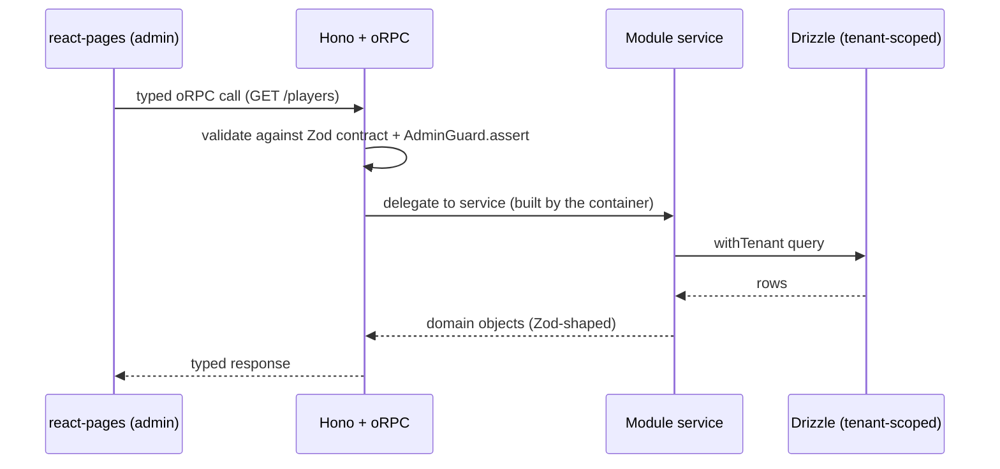

# Architecture

How the platform fits together: the contract spine, the plugin host that loads
everything, the adapter seams that keep it swappable, and how a downstream
consumer (Consumer) reuses it without forking.

For the rationale behind each choice, see the [ADRs](./adr/). For the rules an
agent must follow, see [AGENTS.md](../AGENTS.md).

## System overview

```mermaid
flowchart TB
  subgraph contracts["Contracts - the source of truth"]
    zod["shared-schemas<br/>single Zod root"]
    orpc["orpc-contract<br/>composed oRPC router"]
    openapi["docs/openapi.json<br/>(emitted)"]
    client["typed client<br/>(zero codegen)"]
    zod --> orpc
    orpc --> openapi
    orpc --> client
  end

  subgraph runtime["API runtime - apps/api calls createApp()"]
    cfg["extensions.config.ts<br/>plugin registry"]
    host["plugin-host<br/>definePlugin / ModuleRegistry"]
    container["Container<br/>functional composition (tokens -> factories)"]
    hono["Hono + oRPC OpenAPIHandler<br/>validation, OpenAPI emit"]
    cfg --> host
    host --> container
    container --> hono
    orpc --> hono
  end

  subgraph platform["Platform services (packages/platform/*)"]
    db["@oss/db<br/>Drizzle client + migrations + tenant scope"]
    auth["auth<br/>better-auth + AdminGuard"]
    core["core<br/>logger, tenant ctx, EventBus"]
  end

  subgraph modules["Business modules (packages/modules/*)"]
    mod["identity, wallet, gaming, lobby, bonus,<br/>compliance, chat, cms, backoffice, player ..."]
    adapters["@oss/adapters<br/>vendor adapter interfaces"]
    mod --> adapters
  end

  vendor["Vendor adapters<br/>PSP, KYC, aggregator, chat"]

  host --> mod
  container --> auth
  mod --> db
  mod --> core
  adapters -. implemented by .-> vendor

  subgraph ui["Headless UI (ADR-0013 layered)"]
    uic["ui-provider-contract<br/>component interface"]
    shad["ui-provider-daisyui<br/>shipped adapter"]
    hooks["react-hooks<br/>data hooks, transport, UIProvider ctx,<br/>cross-cutting helpers, /server (RSC)"]
    blocks["react-blocks<br/>presentational primitives<br/>(consume UIProvider)"]
    pages["react-pages<br/>composed pages, ui-plugin registry,<br/>theme (brandScope), AppShell, OssProviders"]
    uiplug["UI plugin registry<br/>defineUIPlugin + slots + tokens"]
    shad -. implements .-> uic
    pages --> blocks
    pages --> hooks
    blocks --> uic
    blocks --> hooks
    uiplug --> pages
  end
  client --> hooks

  subgraph consumer["Downstream consumer - Consumer (reference)"]
    bapi["apps/api<br/>thin createApp()"]
    bweb["apps/web (Next App Router)<br/>mounts react-pages pages,<br/>prefetches via react-hooks/server"]
    bbo["apps/backoffice (Vite + TanStack Router SPA)<br/>mounts react-pages admin pages"]
    bplug["@consumer/plugins<br/>one feature per folder"]
    bcfg["extensions.config.ts<br/>+ pnpm link: overrides"]
    bplug --> bcfg
    bcfg --> bapi
  end
  hono -. createApp + link .-> bapi
  sdk --> bweb
  shad --> bweb
  uiplug --> bweb

  subgraph ai["AI dev surface"]
    mcp["mcp-server-dev<br/>stdio, via .mcp.json"]
    scaffold["tools/scaffold.ts<br/>+ slash commands"]
    agentsmd["AGENTS.md<br/>(per package)"]
  end
  mcp -. inspects .-> orpc
  scaffold -. generates .-> mod
```

Solid arrows are runtime/build dependencies; dashed arrows are **adapter seams**
(one side declares an interface, the other implements it - swap freely).

## The parts

**Contracts**

- **shared-schemas** - shared Zod schemas (cross-cutting primitives + identity). Per-module request/response schemas live with the router in `orpc-contract`. Every type is `z.infer`'d, never hand-written. ADR-0004.
- **orpc-contract** - composes each module's router into one contract. From it the build emits `docs/openapi.json` and a fully typed client (no codegen step). ADR-0001.

**API runtime**

- **extensions.config.ts** - the one list of enabled plugins (modules + overlays). The only place wiring is turned on.
- **plugin-host** - `definePlugin({ id, dependsOn, register })` + `ModuleRegistry`. In `register(ctx)` a plugin binds providers (`ctx.provide(token, factory)`), mounts routers (`ctx.routers.add(namespace, (c) => router)`), fills UI slots, subscribes to events, and registers MCP tools. Overlays add their own `pgTable` in their module's `src/schema/index.ts`. ADR-0002.
- **Hono + oRPC** - oRPC defines routes and validates I/O against the Zod contract; its `OpenAPIHandler` is mounted on a Hono server and emits `docs/openapi.json`. Dependency wiring is a small **functional composition `Container`** (`@oss/core`): typed-token factories, lazy + last-wins, no decorators. `apps/api` is a thin caller of `createApp()` from `@oss/api-runtime`; downstream consumers call the same factory. ADR-0009.

**Platform services** (`packages/platform/*`) - shared infrastructure modules may import: `db` (`@oss/db` - Drizzle client, drizzle-kit migrations, `DrizzleService`, the framework-free `@oss/db/orm` re-export, tenant-scoped helpers), `auth` (better-auth + the shared `AdminGuard`), `core` (logger, tenant context, typed `EventBus`, composition `Container`), `plugin-host` (the plugin loader).

**Business modules** (`packages/modules/*`) - one folder per domain. A module may import contracts, platform, UI, and SDK packages, but **never another module** - cross-module communication goes through events or shared contracts. Each depends on vendor adapter interfaces from `@oss/adapters`.

**Vendor adapters** - concrete implementations of a module's adapter interfaces (PSP, KYC vendor, igaming aggregator, chat), shipped as separate packages. The interface is the seam; the implementation is swappable.

**Background jobs** - long-running work runs off the request path in a BullMQ worker shipped as an overlay plugin (`/scaffold-plugin <name>-worker`): a module emits an event via the typed `EventBus`, the worker plugin subscribes in `register(ctx)` and processes the job. There is no standalone worker app.

**Headless UI**

- **ui-provider-contract** - the component interface (`Button`, `Input`, `DataTable`, slots). Module UI imports only this. ADR-0003.
- **ui-provider-daisyui** - the single adapter shipped by the platform (Tailwind v4 + DaisyUI semantic classes), implementing the contract. Swap it for your own (MUI, Chakra, ...) with no module changes.
- **react-hooks** - leaf SDK package: data hooks, typed oRPC client, auth, UIProvider context, cross-cutting helpers (`usePageContext`, `useDataExtension`, `RoleGate`). `./server` subpath ships RSC-only prefetchers (`prefetchLobby`, `prefetchGames`, `prefetchWallet`).
- **react-blocks** - presentational primitives consuming UIProvider (`StatCard`, `Skeleton`, `Pagination`, `TimeSeriesChart`, icons). Subpaths `./admin` + `./player`.
- **react-pages** - composed pages, theme (with multi-brand `brandScope`), `OssProviders`, `AppShell`, and the ui-plugin registry. Subpaths `./admin`, `./player`, `./ui-plugin`, `./theme`. Root barrel re-exports hooks + blocks for ergonomic consumer migration.
- **UI plugin registry** - `defineUIPlugin({ slots, columns, nav, routes })` lets a plugin extend the admin + player surface. Slot contributions support `visibleWhen` / `requiresPermission` / `brandScope` / `featureFlag` for declarative gating. ADR-0006 + ADR-0013.
- **plugin-test-kit** - `validatePlugin()` / `assertValidPlugin()` for operator suites.
- **compliance-invariants** - canonical list of `SealedToken<T>` services operators may never override (RG enforcement, KYC writes, AML/SAR, ledger writes, RNG, etc.) with regulatory citations.

**Downstream consumer (Consumer, reference)** - does **not** fork. `apps/api` is a thin `createApp()` entry with its own `extensions.config.ts`; `@oss/*` packages resolve via `pnpm` workspace overrides (`link:`). `apps/web` (Next.js App Router, RSC + SSR) mounts react-pages player pages in route shims that prefetch via `@oss/react-hooks/server` and hydrate the client. `apps/backoffice` (Vite + TanStack Router SPA) mounts react-pages admin pages directly. Per-operator customization lives in plugins under `apps/api/src/extensions/` + UI plugins via `defineUIPlugin`. ADR-0005 + ADR-0012 + ADR-0013.

**AI dev surface**

- **mcp-server-dev** - a stdio MCP server (registered in `.mcp.json`, not a port) exposing read-only inspection (`list-modules`, `list-routes`, `query-openapi`, `get-drizzle-schema`, ...) and write tools that delegate to the scaffolder.
- **tools/scaffold.ts** - deterministic code-mods behind the `/scaffold-*` slash commands (module, plugin, route, ui-component). Consumer adds `/scaffold-feature` for its plugins package.
- **AGENTS.md** - per-package brief; the first thing an agent reads.

## Adapter / bridge seams

These are the swap points - the reason the platform is "headless" and extensible:

| Seam          | Interface side                    | Implementation side                        | Swap to...                                       |
| ------------- | --------------------------------- | ------------------------------------------ | ------------------------------------------------ |
| Plugin host   | `definePlugin` contract           | a module or overlay folder                 | add/remove features without touching core        |
| Vendor adapter | `@oss/adapters` (interface)          | impl package under `modules/<m>/adapters/<vendor>/` | a different PSP, KYC, or aggregator   |
| UI provider   | `ui-provider-contract`            | `ui-provider-daisyui` (shipped)            | your own component library                       |
| UI plugin     | `defineUIPlugin` slots            | a plugin's `ui.tsx`                        | extend the admin without forking the SDK         |
| Consumer link | `createApp()` + `@oss/*` packages | downstream `apps/api` + `link:` overrides  | publish to npm and bump the tag (no code change) |

## Request flow (a typical read)

## Inter-module communication & scalability

The API layer is a backend-for-frontend: it triggers commands and serves reads.
Modules do **not** call each other - they couple to **topics**, not to each
other's routes. See [ADR-0010](./adr/0010-event-driven-broker-and-microservices.md)
for the full direction; the shape:

- **Events for side effects.** A module emits via the typed `EventBus` (payloads
  validated against the Zod catalog in `shared-schemas/events.ts`); any number of
  modules subscribe (fan-out) with `ctx.events.on(...)`, wired to the bus at boot
  by `createApp`. Bonuses, AML checks, leaderboards, notifications, and
  personalization react this way. Consumers must be idempotent (delivery is
  at-least-once once a durable broker is bound). A throwing subscriber is logged
  and isolated - it never breaks the emitter or its siblings.
- **Synchronous + atomic for money - via command ports.** Placing a bet (wallet
  debit, balance check, RGS result) and pre-action gates (KYC/jurisdiction) run
  inside a single `db.transaction(...)` - never "emit and hope". A module that must
  mutate another synchronously calls the owner's **command port** passing its own
  `tx` (eg sportsbook -> `WALLET_COMMANDS.debit(tx, ...)`): atomic in-process, yet
  decoupled enough to split later (a remote impl runs a saga). Events record what
  already happened; they never move funds.
- **Broker behind a seam.** The `EventBus` is a typed facade over a
  `MessageBrokerAdapter` (`MESSAGE_BROKER` token); the default binding is an
  in-process broker. Bind a durable driver - **Redpanda** (Kafka API) for the
  regulated audit/ledger/replay stream, NATS JetStream for lighter fan-out - in an
  overlay to swap the transport without touching module code.
- **Durable events via the outbox.** When an event must survive a crash or a
  process boundary, a service emits it inside its transaction with
  `events.emitInTransaction(tx, ...)`: the envelope is written to `event_outbox`
  atomically with the state change, and the `OutboxRelay` publishes it after commit
  (at-least-once; consumers dedup on `eventId`). Opt-in via `OUTBOX_ENABLED` / a
  durable broker; off in the in-process monolith.
- **Client push is separate.** WebSockets/SSE are client-facing only (chat,
  balance/bonus toasts), never the transport between modules.
- **Modular monolith now, microservices later.** The no-cross-module-imports rule,
  the broker seam, and the outbox make a hot module (eg `bonus`, `aggregator`)
  extractable into its own deployable. The same codebase boots a subset via
  `SERVICE_MANIFEST` (`pnpm create:service` scaffolds a thin host); point its broker
  at the shared stream and its events keep flowing. The `no-cross-module-schema-read`
  lint warning flags the remaining shared-table couplings to retire first. Scale the
  stateless Hono API horizontally; scale async work by moving consumers to their own
  services. See [ADR-0017](./adr/0017-extraction-readiness-manifest-outbox-command-ports.md).
