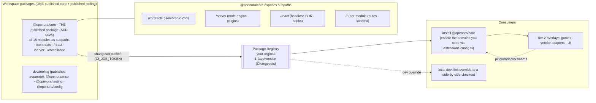
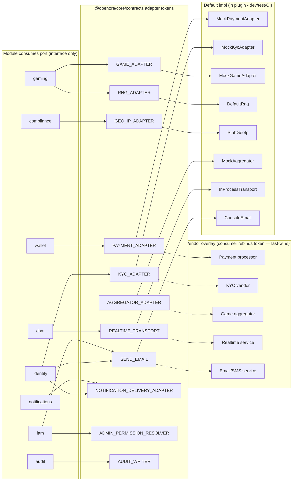
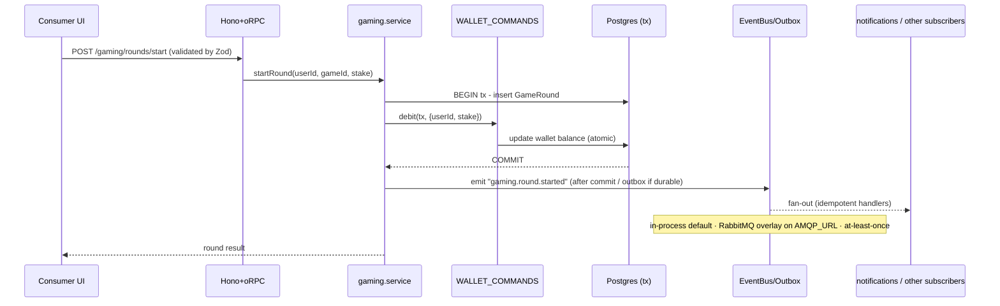
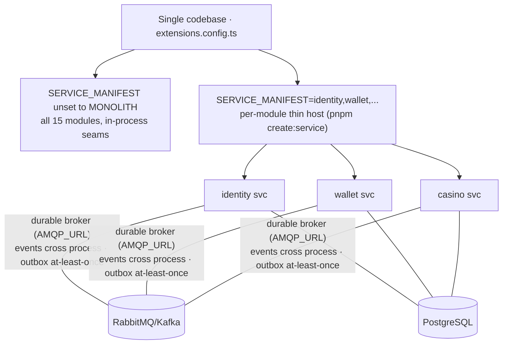

# System design

The whole platform in one place: the single `@openora/core` package and its domains, the
contract spine, the plugin host, the adapter ports, the three async seams, and how a
downstream consumer overlays proprietary code. The reference table at the bottom is generated
from `docs/catalog.json` and carries the current counts; the prose here does not repeat them.

> **Packaging note (ADR-0025, 2026-06-16):** the foundation + engine + free domains
> now ship as ONE published package, `@openora/core`, with subpaths (`@openora/core/contracts`,
> `@openora/core/react`, `@openora/core/server`, `@openora/core/compliance`, and per-module subpaths).
> The diagrams below show the LOGICAL module layout (contract spine, plugin host, adapters,
> domains) which is unchanged - only the distribution unit collapsed. The diagram specifier
> names (`@openora/orpc-contract`, `@openora/shared-schemas`, `@openora/adapters`, `@openora/db`, `@openora/auth`,
> `@openora/api-runtime`, `@openora/plugin-host`, `@openora/react`) are now subpaths of `@openora/core`.

For rationale see the [ADRs](../adr/) — especially [ADR-0025](../adr/0025-single-core-package-with-module-subpaths.md)
(single `@openora/core` package, supersedes ADR-0024 packaging), [ADR-0024](../adr/0024-domain-as-package-and-distribution-tiers.md)
(domain-as-package + distribution, supersedes ADR-0022), [ADR-0021](../adr/0021-everything-is-an-add-on.md)

- [ADR-0020](../adr/0020-editions-and-add-on-modules.md) (the add-on / editions tier, removed 2026-07-26 - every module now ships in core),
  [ADR-0014/0016/0017](../adr/) (seams, envelope, outbox). Consumer wiring: [downstream-consumer.md](../guides/downstream-consumer.md).

## 1. Mega architecture — the whole system

```mermaid
flowchart TB
  %% ============ TIER 2: CONSUMER (non-shared IP) ============
  subgraph T2["TIER-2 · Consumer repo (proprietary, non-shared IP, never published to OSS)"]
    direction TB
    subgraph T2UI["Custom UI (DaisyUI + Tailwind)"]
      WEB["apps/web<br/>player frontend"]
      BO["apps/backoffice<br/>admin panel"]
      UIPKG["packages/ui<br/>design system"]
    end
    subgraph T2GAMES["Custom first-party games (plug into casino game seam)"]
      JW["Wheel-spin game"]:::game
      CF["Coin-toss PvP game"]:::game
      MN["Grid-reveal PvP game"]:::game
      RR["Chamber-elimination game"]:::game
      DD["Dice-roll PvP game"]:::game
      GR["Peer gifting & giveaway feature"]:::game
    end
    subgraph T2VEND["Vendor adapters (implement @openora/core/contracts ports)"]
      FB["Payment processor<br/>PSP integration"]:::vend
      SS["KYC provider"]:::vend
      EM["Game aggregator"]:::vend
      ABLY["Realtime transport"]:::vend
      MAIL["Email + SMS provider"]:::vend
    end
    APIHOST["consumer apps/api<br/>createApp() host<br/>extensions.config.ts"]:::host
    INFRA2["consumer infrastructure<br/>any Node runtime + Postgres"]:::host
  end

  %% ============ SDK ============
  subgraph SDK["@openora/core/react · headless SDK (browser)"]
    HOOKS["data hooks · auth · transport"]
    TC["typed oRPC client<br/>(zero codegen)"]
    OAPI["runtime OpenAPI reference"]
  end

  %% ============ ENGINE (@openora/core/server) ============
  subgraph RT["@openora/core/server · createApp() (node engine)"]
    PH["plugin-host<br/>Plugin · ModuleRegistry · applyServiceManifest"]
    DI["Container<br/>tokens to factories (last-wins overlay)"]
    HONO["Hono + oRPC OpenAPIHandler<br/>validation · live OpenAPI reference"]
    GATE["SERVICE_MANIFEST module filter"]
  end

  %% ============ CONTRACT SPINE (@openora/core/contracts + /compliance) ============
  subgraph SPINE["@openora/core/contracts + /compliance (isomorphic)"]
    ZOD["/contracts<br/>Zod schemas · events.ts · igaming-config"]
    OC["/contracts<br/>composeContract + health (no aggregation)"]
    ADP["/contracts<br/>adapter port tokens (createToken)"]
    CINV["/compliance<br/>sealed tokens + invariants"]
  end

  %% ============ DOMAINS (subpaths of @openora/core, ADR-0025) ============
  subgraph D1["@openora/core/server (engine) + admin/audit domains"]
    AUDIT["audit ⟨audit_log⟩ · @openora/core/audit"]:::core
    IAM["iam ⟨roles·perms·invites⟩ · @openora/core/iam"]:::core
    ADMC["admin-console (read API via ports) · @openora/core/admin-console"]:::core
    DBPKG["@openora/core/server: db (Drizzle · migrate)"]:::kern
    AUTHPKG["@openora/core/server: auth (better-auth)"]:::kern
  end
  subgraph D2["@openora/core/pam · player account mgmt"]
    IDENT["identity ⟨user·session·2fa⟩"]:::core
    PROF["profile ⟨player⟩"]:::core
    PM["player-management (PAM)"]:::gated
  end
  subgraph DCOMP["@openora/core/compliance · RG/KYC"]
    COMP["compliance ⟨geo_rule·user_limit⟩"]:::core
  end
  subgraph D3["@openora/core/wallet · money"]
    WAL["wallet ⟨wallet·wallet_transaction⟩"]:::core
  end
  subgraph D4["@openora/core/casino · games"]
    GAM["gaming ⟨Game·GameRound⟩"]:::core
    LOB["lobby ⟨categories·featured⟩"]:::core
  end
  subgraph D6["@openora/core/engagement · CRM/social"]
    CHAT["chat ⟨ChatRoom·ChatMessage⟩"]:::core
    NOT["notifications ⟨notification⟩"]:::core
  end
  subgraph D7["@openora/core/cms · content"]
    CMS["cms ⟨page·banner⟩"]:::core
  end

  %% ============ PORTS / SEAMS ============
  subgraph PORTS["Ports (hexagonal seams · core set shown)"]
    P_PAY["PAYMENT_ADAPTER"]:::port
    P_KYC["KYC_ADAPTER"]:::port
    P_GEO["GEO_IP_ADAPTER"]:::port
    P_GAME["GAME_ADAPTER"]:::port
    P_RNG["RNG_ADAPTER"]:::port
    P_AGG["AGGREGATOR_ADAPTER"]:::port
    P_MAIL["SEND_EMAIL"]:::port
    P_NOTI["NOTIFICATION_DELIVERY_ADAPTER"]:::port
    P_ADMIN["ADMIN_PERMISSION_RESOLVER"]:::port
    P_AUD["AUDIT_WRITER"]:::port
    P_WCMD["WALLET_COMMANDS (sync cmd port)"]:::port
    P_RT["REALTIME_TRANSPORT"]:::port
    P_BROK["MESSAGE_BROKER"]:::seam
    P_JOB["JOB_QUEUE"]:::seam
    P_OUT["OUTBOX"]:::seam
  end

  %% ============ DATA + INFRA ============
  subgraph DATA["Stores + infra overlays"]
    PG[("PostgreSQL 16")]:::data
    REDIS[("Redis to BullMQ<br/>(REDIS_URL)")]:::data
    RMQ[("RabbitMQ to Kafka<br/>(AMQP_URL)")]:::data
    BUS["EventBus envelope<br/>49 domain events"]:::seam
  end

  %% ---- wiring ----
  WEB & BO --> HOOKS --> TC --> OAPI -->|HTTP /api| HONO
  APIHOST --> RT
  T2GAMES -->|register plugin| GAM
  FB -.->|binds| P_PAY
  SS -.->|binds| P_KYC
  EM -.->|binds| P_AGG
  ABLY -.->|binds| P_RT
  MAIL -.->|binds| P_MAIL

  HONO --> PH --> DI
  PH --> GATE
  RT --> SPINE
  OC --> TC
  ZOD --> OC

  D1 & D2 & DCOMP & D3 & D4 & D6 & D7 --> DI
  WAL ==>|owns| P_WCMD
  GAM ==>|debit tx| P_WCMD
  IAM -->|dependsOn| IDENT
  PM -.->|reads /schema| PROF
  LOB -.->|reads /schema| GAM

  WAL --> P_PAY
  IDENT --> P_KYC & P_MAIL & P_NOTI
  IAM --> P_ADMIN & P_MAIL
  COMP --> P_GEO
  AUDIT --> P_AUD
  GAM --> P_GAME & P_RNG
  CHAT --> P_RT
  NOT --> P_NOTI

  D1 & D2 & D3 & D4 & D6 & D7 -->|after commit| BUS
  BUS --- P_BROK
  P_BROK -.->|AMQP_URL overlay| RMQ
  P_JOB -.->|REDIS_URL overlay| REDIS
  P_OUT --> PG
  DBPKG --> PG
  D1 & D2 & D3 & D4 & D6 & D7 --> DBPKG

  classDef game fill:#fde2e2,stroke:#c0392b,color:#000
  classDef vend fill:#f9c0c0,stroke:#a93226,color:#000
  classDef host fill:#d6eaf8,stroke:#2471a3,color:#000
  classDef core fill:#d5f5e3,stroke:#1e8449,color:#000
  classDef gated fill:#fdebd0,stroke:#ca6f1e,color:#000
  classDef kern fill:#aed6f1,stroke:#1f618d,color:#000
  classDef port fill:#e8daef,stroke:#6c3483,color:#000
  classDef seam fill:#f5cba7,stroke:#935116,color:#000
  classDef data fill:#fcf3cf,stroke:#9a7d0a,color:#000
```

## 2. Publishing & distribution model (ADR-0025)

The single `@openora/core` package ships under one fixed version (Changesets, no
cross-domain version skew). A consumer installs the one core package; its subpaths expose
all 15 modules (`@openora/core/<domain>/<module>` routes). The runtime contract is composed
only in the consumer's `createApp()` call via `composeContract` - that is what keeps every
subset independently usable.

## 3. Ports & adapters — default (mock) ↔ vendor overlay

## 4. Money + event lifecycle (game round → wallet debit → fan-out)

## 5. Deployment topology — monolith ↔ split services (SERVICE_MANIFEST)

## Reference - domain -> modules -> tables -> routes

<!-- gen:catalog-reference -->

Generated from `docs/catalog.json` - 20 modules, 250 routes, 44 adapter ports, 111 events. Edit the code, then run `pnpm gen:catalog`.

| Domain                        | Modules                                                    | Tables                                                                              | Routes |
| ----------------------------- | ---------------------------------------------------------- | ----------------------------------------------------------------------------------- | ------ |
| `@openora/core/admin-console` | admin-console                                              | (owns none - reads through ports)                                                   | 8      |
| `@openora/core/analytics`     | analytics                                                  | (owns none - reads through ports)                                                   | 3      |
| `@openora/core/audit`         | audit                                                      | audit_log                                                                           | 3      |
| `@openora/core/casino`        | gaming · lobby                                             | featured_slot, game, game_round, lobby_category + 1 more                            | 9      |
| `@openora/core/cms`           | cms                                                        | banner_configuration, banner_image, banner_schedule, page                           | 18     |
| `@openora/core/compliance`    | compliance                                                 | geo_rule, kyc_verification, rg_exclusion, rg_flag + 1 more                          | 26     |
| `@openora/core/engagement`    | chat · chat-commands · notifications · social              | chat_command_config, chat_message, chat_mute, chat_platform_ban + 11 more           | 72     |
| `fx`                          | exchange-rate                                              | exchange_rate_quote                                                                 | 2      |
| `@openora/core/iam`           | iam                                                        | admin_invitation, admin_role, admin_role_assignment, admin_role_permission          | 17     |
| `@openora/core/mail`          | mail                                                       | (owns none - reads through ports)                                                   | 0      |
| `@openora/core/pam`           | identity · player-management · player-note · profile · tag | account, admin_trusted_device, player, player_note + 8 more                         | 57     |
| `@openora/core/wallet`        | wallet                                                     | auto_withdrawal_rule, wallet, wallet_asset, wallet_auto_withdrawal_config + 10 more | 35     |

<!-- /gen:catalog-reference -->

## Cross-domain edges (lint-enforced — ADR-0015)

| From → To                   | Channel                                                        |
| --------------------------- | -------------------------------------------------------------- |
| iam → identity              | `dependsOn` (load order)                                       |
| gaming → wallet             | `WALLET_COMMANDS` synchronous command port (same `tx`, atomic) |
| player-management → profile | read-only `@openora/core/pam/schema/profile`                   |
| lobby → gaming              | read-only `@openora/core/casino/schema/gaming`                 |
| any → any                   | domain **events** via `EventBus` — never money                 |

The adapter ports and 3 async seams (`MESSAGE_BROKER`, `JOB_QUEUE`, `REALTIME_TRANSPORT`) plus
the transactional `OUTBOX` carry everything else. Money and needed-now reads stay synchronous
and transactional; nothing else imports another module's internals.
