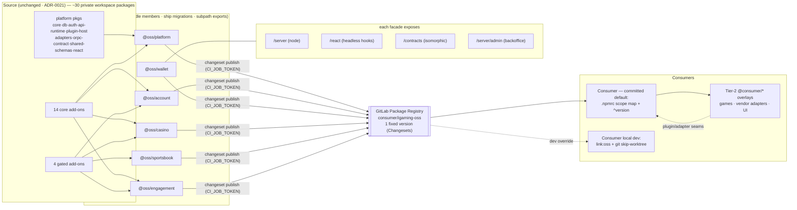
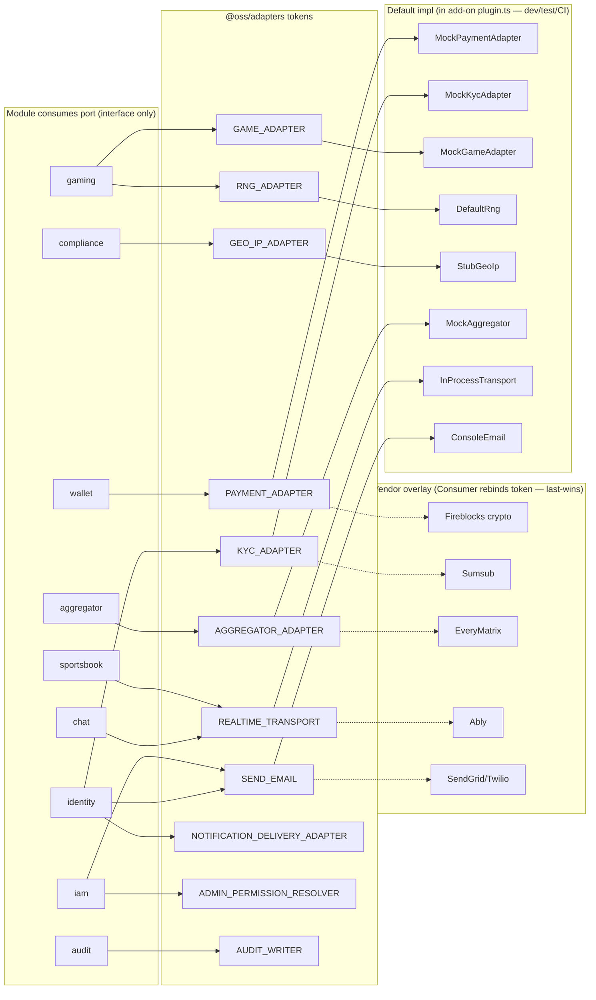
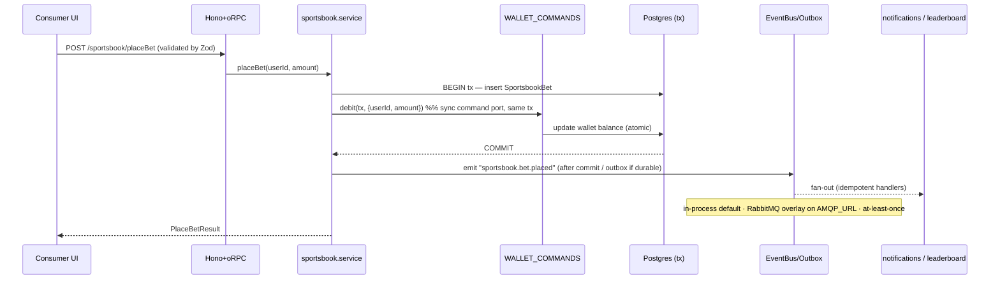
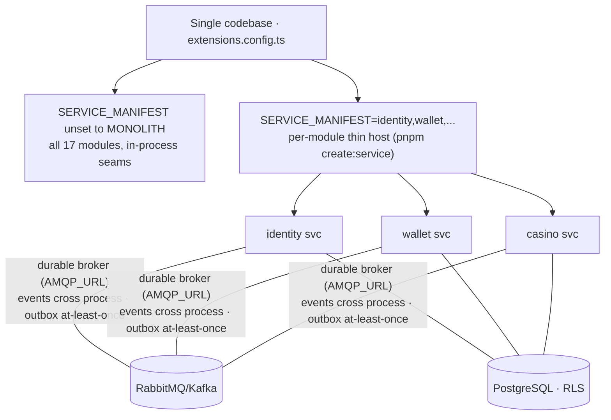

# System design

The whole platform in one place: the six published domains, the contract spine, the
plugin host, the 15 adapter ports, the three async seams, and how a downstream consumer
(Consumer) overlays proprietary code. Generated from `docs/catalog.json` (17 modules,
15 adapters, 24 events, 79 HTTP routes), `extensions.config.ts`, and the package graph.

For rationale see the [ADRs](./adr/) — especially [ADR-0022](./adr/0022-domain-distribution-packages.md)
(six domain distribution packages), [ADR-0021](./adr/0021-everything-is-an-add-on.md)
(standalone add-ons), [ADR-0020](./adr/0020-editions-and-add-on-modules.md) (editions),
[ADR-0014/0016/0017](./adr/) (seams, envelope, outbox). Consumer wiring: [downstream-consumer.md](./downstream-consumer.md).

## 1. Mega architecture — the whole system

```mermaid
flowchart TB
  %% ============ TIER 2: CONSUMER (non-shared IP) ============
  subgraph T2["TIER-2 · Consumer repo (proprietary, non-shared IP, never published to OSS)"]
    direction TB
    subgraph T2UI["Custom UI (DaisyUI + Tailwind)"]
      WEB["apps/web<br/>player frontend"]
      BO["apps/backoffice<br/>admin panel"]
      UIPKG["packages/ui<br/>design system"]
    end
    subgraph T2GAMES["Custom first-party games (plug into casino game seam)"]
      JW["Jackpot Wheel"]:::game
      CF["CoinFlip PvP"]:::game
      MN["Mines PvP"]:::game
      RR["Russian Roulette"]:::game
      DD["Dice Duel"]:::game
      GR["Gifts + Rain"]:::game
    end
    subgraph T2VEND["Vendor adapters (implement @oss/adapters ports)"]
      FB["Fireblocks<br/>crypto wallet"]:::vend
      SS["Sumsub<br/>KYC"]:::vend
      EM["EveryMatrix<br/>casino aggregator"]:::vend
      OM["OddsMatrix / Betby<br/>sportsbook feed"]:::vend
      ABLY["Ably<br/>realtime"]:::vend
      MAIL["SendGrid / Twilio<br/>email + SMS"]:::vend
    end
    APIHOST["apps/api<br/>createApp() host<br/>extensions.config.ts + editions.ts"]:::host
    INFRA2["apps/infra<br/>Pulumi + awsx (AWS)"]:::host
  end

  %% ============ SDK ============
  subgraph SDK["@oss/react · headless SDK (browser, shared IP)"]
    HOOKS["data hooks · auth · transport"]
    TC["typed oRPC client<br/>(zero codegen)"]
    OAPI["docs/openapi.json (emitted)"]
  end

  %% ============ API RUNTIME ============
  subgraph RT["@oss/api-runtime · createApp() (node, shared IP)"]
    PH["@oss/plugin-host<br/>definePlugin · ModuleRegistry · applyServiceManifest"]
    DI["@oss/core Container<br/>tokens to factories (last-wins overlay)"]
    HONO["Hono + oRPC OpenAPIHandler<br/>validation · OpenAPI emit · RLS tenant ALS"]
    GATE["editions: OSS_ADDONS allowlist<br/>SERVICE_MANIFEST module filter"]
  end

  %% ============ CONTRACT SPINE ============
  subgraph SPINE["Contract spine (isomorphic, shared IP)"]
    ZOD["@oss/shared-schemas<br/>single Zod root · events.ts · igaming-config"]
    OC["@oss/orpc-contract<br/>aggregates every add-on /contract slice"]
    ADP["@oss/adapters<br/>port tokens (createToken)"]
    CINV["@oss/compliance-invariants"]
  end

  %% ============ THE 6 DOMAINS (17 modules) ============
  subgraph D1["@oss/platform · kernel + cross-cutting"]
    AUDIT["audit ⟨audit_log⟩"]:::core
    IAM["iam ⟨roles·perms·invites⟩"]:::core
    DBPKG["@oss/db Drizzle + RLS · migrate-all"]:::kern
    AUTHPKG["@oss/auth better-auth"]:::kern
  end
  subgraph D2["@oss/account · player account"]
    IDENT["identity ⟨user·session·2fa⟩"]:::core
    PROF["profile ⟨player⟩"]:::core
    PM["player-management (PAM)"]:::gated
    COMP["compliance ⟨geo_rule·user_limit⟩"]:::core
  end
  subgraph D3["@oss/wallet · money"]
    WAL["wallet ⟨wallet·wallet_transaction⟩"]:::core
  end
  subgraph D4["@oss/casino · games"]
    GAM["gaming ⟨Game·GameRound⟩"]:::core
    AGG["aggregator ⟨provider⟩"]:::gated
    LOB["lobby ⟨categories·featured⟩"]:::core
  end
  subgraph D5["@oss/sportsbook"]
    SB["sportsbook ⟨event·selection·bet⟩"]:::gated
  end
  subgraph D6["@oss/engagement · CRM/social"]
    CHAT["chat ⟨ChatRoom·ChatMessage⟩"]:::core
    NOT["notifications ⟨notification⟩"]:::core
    BON["bonus ⟨bonus·user_bonus⟩"]:::core
    LB["leaderboard"]:::gated
    CMS["cms ⟨page·banner⟩"]:::core
    ADMC["admin-console (read API)"]:::core
  end

  %% ============ PORTS / SEAMS ============
  subgraph PORTS["Ports (15 tokens · hexagonal seams)"]
    P_PAY["PAYMENT_ADAPTER"]:::port
    P_KYC["KYC_ADAPTER"]:::port
    P_GEO["GEO_IP_ADAPTER"]:::port
    P_GAME["GAME_ADAPTER"]:::port
    P_RNG["RNG_ADAPTER"]:::port
    P_AGG["AGGREGATOR_ADAPTER"]:::port
    P_MAIL["SEND_EMAIL"]:::port
    P_NOTI["NOTIFICATION_DELIVERY_ADAPTER"]:::port
    P_ADMIN["ADMIN_PERMISSION_RESOLVER"]:::port
    P_AUD["AUDIT_WRITER"]:::port
    P_WCMD["WALLET_COMMANDS (sync cmd port)"]:::port
    P_RT["REALTIME_TRANSPORT"]:::port
    P_BROK["MESSAGE_BROKER"]:::seam
    P_JOB["JOB_QUEUE"]:::seam
    P_OUT["OUTBOX"]:::seam
  end

  %% ============ DATA + INFRA ============
  subgraph DATA["Stores + infra overlays"]
    PG[("PostgreSQL 16<br/>RLS tenant isolation")]:::data
    REDIS[("Redis to BullMQ<br/>(REDIS_URL)")]:::data
    RMQ[("RabbitMQ to Kafka<br/>(AMQP_URL)")]:::data
    BUS["EventBus envelope<br/>24 domain events"]:::seam
  end

  %% ---- wiring ----
  WEB & BO --> HOOKS --> TC --> OAPI -->|HTTP /api| HONO
  APIHOST --> RT
  T2GAMES -->|register plugin| GAM
  FB -.->|binds| P_PAY
  SS -.->|binds| P_KYC
  EM -.->|binds| P_AGG
  OM -.->|feeds| SB
  ABLY -.->|binds| P_RT
  MAIL -.->|binds| P_MAIL

  HONO --> PH --> DI
  PH --> GATE
  RT --> SPINE
  OC --> TC
  ZOD --> OC

  D1 & D2 & D3 & D4 & D5 & D6 --> DI
  WAL ==>|owns| P_WCMD
  SB ==>|debit tx| P_WCMD
  IAM -->|dependsOn| IDENT
  PM -.->|reads /schema| PROF
  LOB -.->|reads /schema| GAM

  WAL --> P_PAY
  IDENT --> P_KYC & P_MAIL & P_NOTI
  IAM --> P_ADMIN & P_MAIL
  COMP --> P_GEO
  AUDIT --> P_AUD
  GAM --> P_GAME & P_RNG
  AGG --> P_AGG
  CHAT --> P_RT
  SB --> P_RT
  NOT --> P_NOTI

  D1 & D2 & D3 & D4 & D5 & D6 -->|after commit| BUS
  BUS --- P_BROK
  P_BROK -.->|AMQP_URL overlay| RMQ
  P_JOB -.->|REDIS_URL overlay| REDIS
  P_OUT --> PG
  DBPKG --> PG
  D1 & D2 & D3 & D4 & D5 & D6 --> DBPKG

  classDef game fill:#fde2e2,stroke:#c0392b,color:#000
  classDef vend fill:#f9c0c0,stroke:#a93226,color:#000
  classDef host fill:#d6eaf8,stroke:#2471a3,color:#000
  classDef core fill:#d5f5e3,stroke:#1e8449,color:#000
  classDef gated fill:#fdebd0,stroke:#ca6f1e,color:#000
  classDef kern fill:#aed6f1,stroke:#1f618d,color:#000
  classDef port fill:#e8daef,stroke:#6c3483,color:#000
  classDef seam fill:#f5cba7,stroke:#935116,color:#000
  classDef data fill:#fcf3cf,stroke:#9a7d0a,color:#000
```

## 2. Publishing & distribution model (ADR-0022)

## 3. Ports & adapters — default (mock) ↔ vendor overlay

## 4. Money + event lifecycle (sportsbook bet → wallet debit → fan-out)

## 5. Deployment topology — monolith ↔ split services (SERVICE_MANIFEST)

## Reference — domain → modules → tables → routes

| Domain | Modules (core / **gated**) | Tables | Routes |
|---|---|---|---|
| `@oss/platform` | audit · iam | audit_log, admin_role / admin_role_assignment / admin_role_permission / admin_invitation | 13 |
| `@oss/account` | identity · profile · **player-management** · compliance | user / session / account / twoFactor / verification, player, geo_rule / user_limit | 28 |
| `@oss/wallet` | wallet | wallet, wallet_transaction | 4 |
| `@oss/casino` | gaming · lobby · **aggregator** | Game / GameRound, LobbyCategory / FeaturedSlot, aggregator_provider | 12 |
| `@oss/sportsbook` | **sportsbook** | SportsbookEvent / SportsbookSelection / SportsbookBet | 4 |
| `@oss/engagement` | chat · notifications · bonus · cms · admin-console · **leaderboard** | ChatRoom / ChatMessage, notification, bonus / user_bonus, page / banner, leaderboard / leaderboard_entry | 18 |

**bold** = gated add-on (`kind: 'addon'`, loads only when listed in `OSS_ADDONS`).

## Cross-domain edges (lint-enforced — ADR-0015)

| From → To | Channel |
|---|---|
| iam → identity | `dependsOn` (load order) |
| sportsbook → wallet | `WALLET_COMMANDS` synchronous command port (same `tx`, atomic) |
| player-management → profile | read-only `@oss-addons/profile/schema` |
| lobby → gaming | read-only `@oss-addons/gaming/schema` |
| any → any | domain **events** via `EventBus` (24 topics) — never money |

15 adapter ports and 3 async seams (`MESSAGE_BROKER`, `JOB_QUEUE`, `REALTIME_TRANSPORT`) plus
the transactional `OUTBOX` carry everything else. Money and needed-now reads stay synchronous
and transactional; nothing else imports another add-on's internals.
